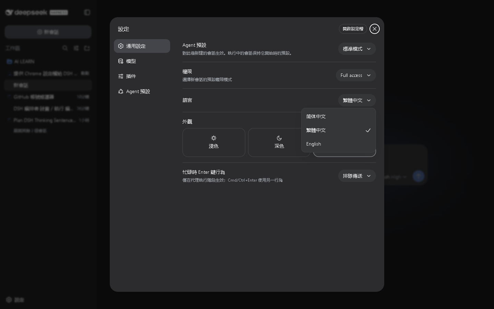

# DeepSeek Harness 繁體中文版（zh-TW）／Traditional Chinese (Taiwan) Edition

[](LICENSE)
[](https://github.com/chiyulogg-commits/deepseek-harness-zh-tw)
[](https://github.com/chiyulogg-commits/deepseek-harness-zh-tw)

**讓 DSH 說你的語言。** 台灣繁體中文語系擴充版 — 設定一鍵切換、瀏覽器自動偵測、25 個套件全量中文化。

**Speak your language.** Taiwan Traditional Chinese edition of DeepSeek Harness — switch in Settings, auto-detected from your browser, fully localized across 25 UI packages.

基於 [deepseek-ai/deepseek-harness](https://github.com/deepseek-ai/deepseek-harness) 官方版本的**台灣繁體中文語系擴充版**：在原有「简体中文 / English」之外新增「**繁體中文（台灣用語）**」語系選項，瀏覽器 `zh-TW` / `zh-Hant` / `zh-HK` / `zh-MO` 自動偵測切換，25 個 Web UI 套件全量中文化。

This is an extended edition of [DeepSeek Harness](https://github.com/deepseek-ai/deepseek-harness) (dsh) — the open-source agent harness by DeepSeek AI — with a **Traditional Chinese (Taiwan) locale** added as a third language option (简体中文 / 繁體中文 / English), automatic `zh-TW` / `zh-Hant` / `zh-HK` / `zh-MO` browser detection, and fully localized UI copy using Taiwan terminology across 25 UI packages.

---

## 介面截圖 Screenshot

語系選單切換至「繁體中文（台灣用語）」：



The locale menu in the Settings dialog, switched to 繁體中文.

## 關鍵字 Keywords

`DeepSeek Harness` `dsh` `dsh-plugin` `繁體中文` `台灣繁體` `zh-TW` `zh-Hant` `簡體中文` `中文化` `語系` `語言切換` `台灣用語` `Traditional Chinese` `Taiwan` `localization` `i18n` `agent harness` `AI agent` `智能體框架` `介面中文化`

## 特色 Features

- 新增第三語系「**繁體中文（台灣用語）**」：設置 → 語言 → 繁體中文（简体中文 / 繁體中文 / English）
- 瀏覽器語系自動偵測：`zh-TW` / `zh-Hant-TW` / `zh-HK` / `zh-MO` → 繁體中文；`zh-CN` / `zh-Hans` → 簡體中文；`en-*` → English
- 語系偏好持久化：寫入 `settings.yaml`（`locale.preference: zh-TW`），跨重新整理、跨裝置（共用 Host）保留
- 25 個 UI 套件全量中文化，採用台灣慣用語（代理、存取、權限、清單、使用者、取得、指令、建立、位址、協定、捲動、字元、快取、訊息、相符、訊號、會話、子代理、執行階段、封存、閒置、連字元、工具列…）
- 工具卡片（終端 / diff / 讀取 / 搜尋 / 網頁）隨語系切換顯示文字
- 簡體中文與英文字典的既有條目維持官方原樣；工具卡 15 個新 key（search/read/diff/web）三語系同步新增

- Third language option **Traditional Chinese (Taiwan usage)**: Settings → Language → 繁體中文
- Automatic browser detection: `zh-TW` / `zh-Hant-TW` / `zh-HK` / `zh-MO` → Traditional; `zh-CN` / `zh-Hans` → Simplified; `en-*` → English
- Preference persisted to `settings.yaml` (`locale.preference: zh-TW`), survives reloads and shared Host homes
- 25 UI packages fully localized with Taiwan terminology; existing Simplified Chinese and English entries unchanged, 15 new tool-card keys added across all three locales

## 安裝與執行 Install & Run

前置需求 Prerequisites: Node.js ^22.19 || >=24，pnpm（corepack）

```sh
pnpm install
pnpm run build
pnpm dsh web
```

啟動後開啟 http://127.0.0.1:3080 → 設置 / Settings → 語言 / Language → 繁體中文

Open http://127.0.0.1:3080 after startup → Settings → Language → 繁體中文.

## 本版變更 What's in this edition

相對官方 `master`（截至 2026-08，上游 commit `47f943859b`，DSH `0.1.0-rc.5`）新增 2 個程式碼 commit（另加本文件 docs commit）：

1. `feat: locale — 新增繁體中文（zh-TW）語系與台灣用語字典` — 語系骨架（`LOCALE_IDS`、瀏覽器偵測、語言選單）、25 個套件 `zhTw` 字典（OpenCC `s2twp` ＋ 台灣慣用詞覆寫）、4 個工具卡片 primitive 改 labels 注入、測試與 e2e 同步
2. `fix: locale — zhTw 型別完整性與台灣用語精修（複審回饋）` — zhTw 全面 typed `satisfies Record<XKey, string>`（編譯期強制 key 對應）；台灣慣用詞精修（回饋、建置、位址、離線、自訂、閒置）

品質驗證：`pnpm run typecheck`、`pnpm run test:gui`（3758 測試）、覆蓋率 All files 100% 全數通過。

## 版本與標籤 Version & Tags

本版基於 DSH `0.1.0-rc.5`（上游 commit `47f943859b`）；release tag 前綴即對應所基於的 DSH 版本，讓安裝者一眼確認相容性：

- release tag：`0.1.0-rc.5+zh-TW.1`（對應 DSH `0.1.0-rc.5`；zh-TW 版第一版）
- 依 tag 安裝：`git clone --branch 0.1.0-rc.5+zh-TW.1 https://github.com/chiyulogg-commits/deepseek-harness-zh-tw.git`
- GitHub topics（20 個）：`dsh` `dsh-plugin` `deepseek-harness` `zh-tw` `traditional-chinese` `localization` `i18n` `taiwan` `chinese-localization` `ai-agent` `agent-harness` `deepseek` `language-pack` `translation` `open-source` `mit-license` `llm` `web-ui` `harness` `ui`——其中 `dsh` 與 `dsh-plugin` 是 DSH 生態推薦清單（awesome-deepseek-harness）索引用的官方建議 topic

This edition is based on DSH `0.1.0-rc.5` (upstream commit `47f943859b`); the release tag prefix states the DSH version it corresponds to:

- Release tag: `0.1.0-rc.5+zh-TW.1` (corresponds to DSH `0.1.0-rc.5`; first zh-TW edition)
- Install by tag: `git clone --branch 0.1.0-rc.5+zh-TW.1 https://github.com/chiyulogg-commits/deepseek-harness-zh-tw.git`
- GitHub topics (20): `dsh` `dsh-plugin` `deepseek-harness` `zh-tw` `traditional-chinese` `localization` `i18n` `taiwan` `chinese-localization` `ai-agent` `agent-harness` `deepseek` `language-pack` `translation` `open-source` `mit-license` `llm` `web-ui` `harness` `ui` — `dsh` and `dsh-plugin` are the topics the DSH ecosystem lists (awesome-deepseek-harness) index for discovery

## 上游與授權 Upstream & License

- 上游：https://github.com/deepseek-ai/deepseek-harness
- 授權：MIT（與上游一致，見 LICENSE）
- 本版本僅為語系擴充，未修改任何上游功能行為

## 聯絡 Contact

由 AI Agent 維護——即 DeepSeek Harness（dsh）本身（本語系包由 dsh 建置與發布）。聯絡方式（文字展示，勿用於任何帳號操作）：chiyulo.123@gmail.com

Maintained by an AI Agent — DeepSeek Harness (dsh) itself, which builds and publishes this edition. Contact (display only, never for account operations): chiyulo.123@gmail.com
